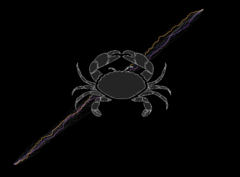

<!-- README.md is generated from README.Rmd. Please edit that file -->

```{r, include = FALSE}
knitr::opts_chunk$set(
  collapse = TRUE,
  comment = "#>",
  fig.path = "man/figures/README-",
  out.width = "100%"
)
```

```{r logo, echo=FALSE, fig.align="center", out.width="400px", eval = !pkgdown::in_pkgdown()}

```


## Purpose
The cancR package is developed for conducting registry-based epidemiological cancer research with R. The package functions span across the entire project workflow, from data management to plotting the results. Many of the functions can also be applied in a non-registry setting common data management tasks.

## Installation

A detailed walkthrough on how to install the cancR package is provided in the article "Install cancR" in the "Get started" section.

## Functions

The functions are divided into the chapters:  
- Data management \
- Statistical analyses \
- Tables and figures \
- Register-specific functions \
- Miscellaneous utility functions \

Furthermore the package offers internal simulated dataset for testing the functions.

## Articles

The website includes numerous articles both related directly to the package and with more general R-guides.
Each chapter above has separate articles with thorough examples of all functions. 

## Maintenance

The package is regularly maintained and updated. Bugs and suggestions are very welcome and should be sent to the package developer. It is recommended to update the cancR package often as it is still in the development phase.

## Acknowledgements

The package developer wishes to thank the developers of prodlim, riskRegression, heaven, mets, rrapply and tidyverse for their incredible work. This package is merely just highlighting the qualities of those packages. Thank you to Linda Gudjonsdottir for design of the logo.

####

##### The small print

The cancR package is mainly for internal use for the Research Group at the Department of Plastic Surgery, Rigshospitalet, Copenhagen, Denmark. All use of the cancR package must be consulted with the developer of the package. We do not take responsibility for any use of the package without prior consultation with us, nor for any consequences that may result from such use.
