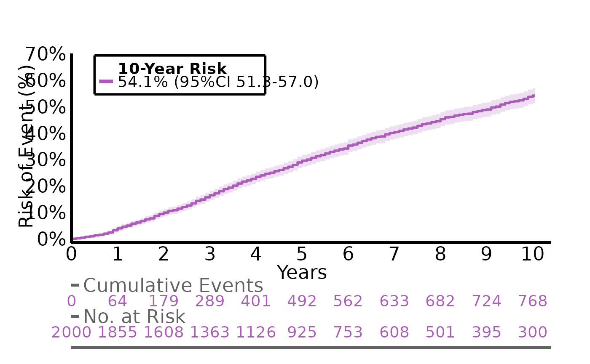
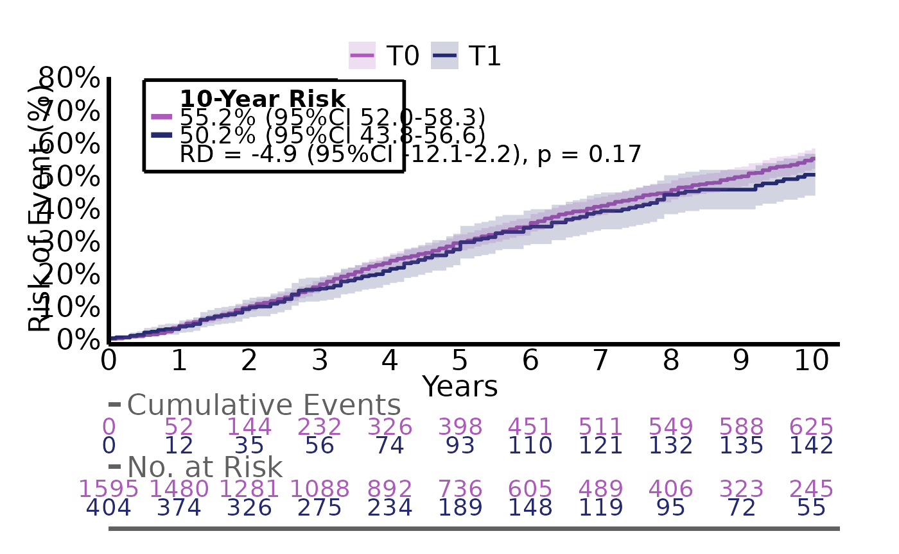
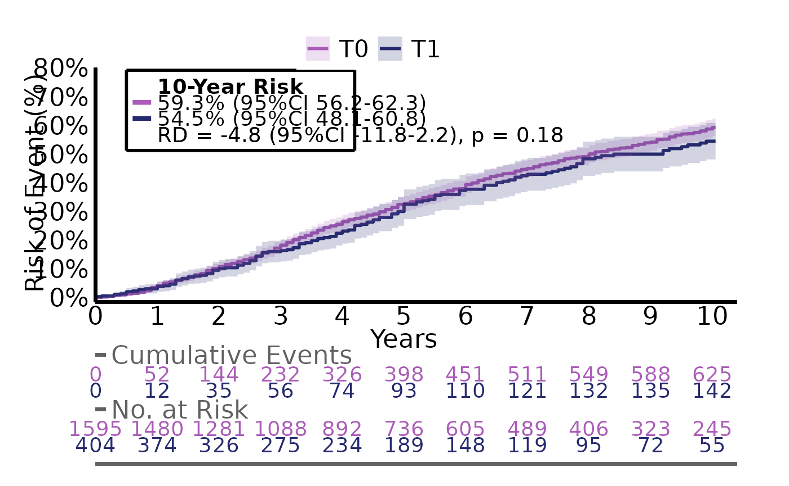
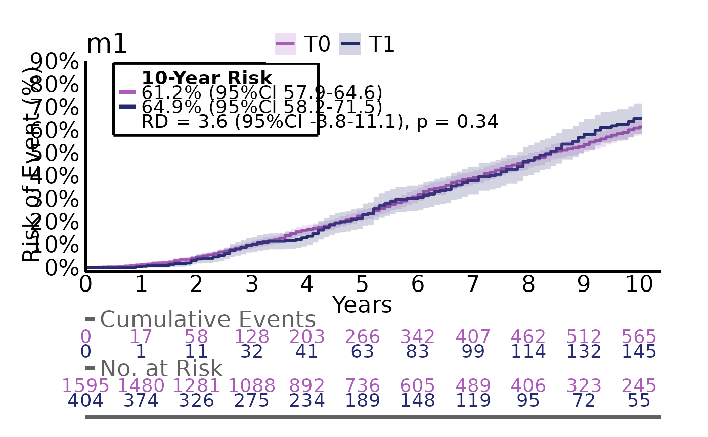
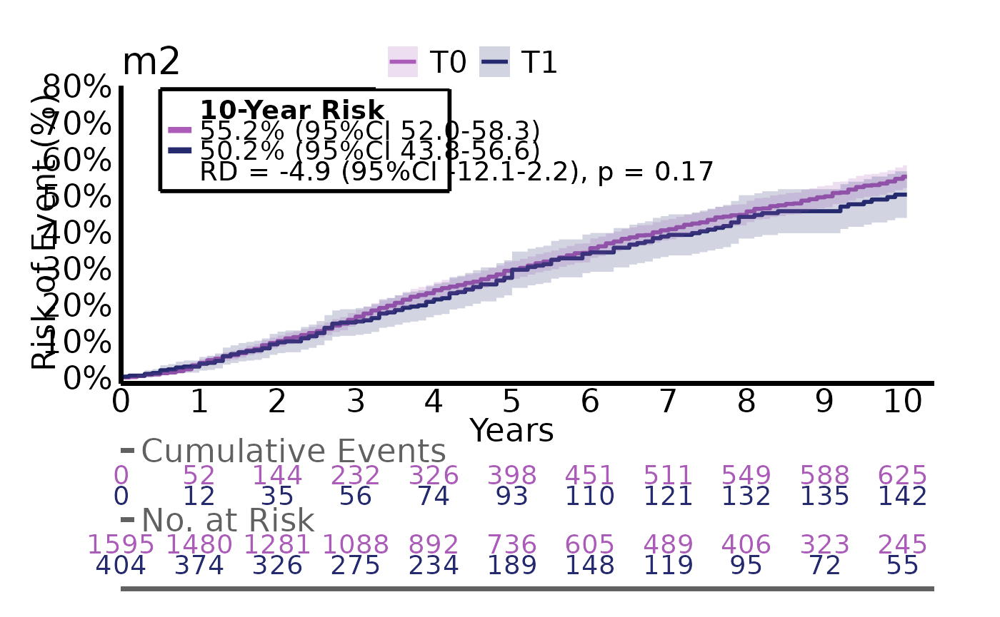
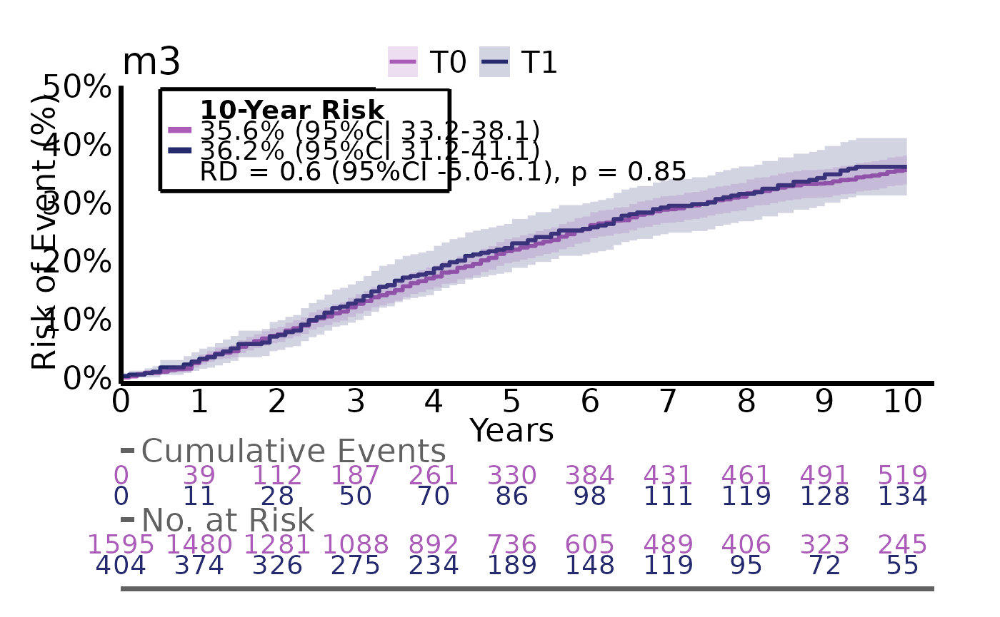

# Analysis of time-to-event data

The prerequisites for analysing time-to-event data are two columns: a
status indicator and a numeric time-to column for the current status.

    #>   status time
    #> 1      0    5
    #> 2      1    1
    #> 3      2    3

The status indicator indicates whether an event has occured and which
type of event.  
- 0 indicates that the patient was event free and the time column
indicates for how long the patient was followed (aka. censoring). This
can be at the end of the database or last clinical visit.  
- 1 indicates the main event of interest such has recurrence, metastasis
or death.  
- Values above 1 indicates competing events, which are events that
prevents the main event from occuring or events that makes the patient
irrelevant for further follow-up.  

In this example, the first patient was followed for 5 years with no
event occuring, the second patient had the event of interest after 1
year and the third patient had the competing event at 3 years.

### Conversion of dates to event/time columns

Often the events of interest are collected as dates as this
automatically includes both status (blank = 0, and present = 1) and the
time point. The `structR` function helps with converting dates to
status/time columns for multiple events. First, we simulate a dataframe
with 10 patients:

``` r
n=10
df <-
  data.frame(
    id = seq(1,n),
    opdate = c(rep("2000-01-01", n-1), "1990-01-01"),
           follow = rep("2025-01-01", n),
           recurrence_date = c(NA, "2005-01-01", NA, NA, NA, "2005-01-01", "2005-01-01", NA, "2005-01-01", "2005-01-01"),
           metastasis_date = c(NA, NA, "2007-01-01", NA, NA, "2006-01-01", "2005-01-01", NA, NA, NA),
           dsd_date = c(NA,NA, "2008-01-01", "2009-01-01", NA, NA, NA, NA, NA, NA),
           death_date = c(NA, NA, "2008-01-01", "2009-01-01", NA, "2010-01-01", "2010-01-01", "2024-01-01", "2019-01-01", "1999-01-01"),
           second_date = c(NA, NA, NA, NA, "2008-01-01", NA, "2001-01-01", NA, NA, NA)) %>%
  datR(c(opdate:second_date))
```

    #>    id     opdate     follow recurrence_date metastasis_date   dsd_date
    #> 1   1 2000-01-01 2025-01-01            <NA>            <NA>       <NA>
    #> 2   2 2000-01-01 2025-01-01      2005-01-01            <NA>       <NA>
    #> 3   3 2000-01-01 2025-01-01            <NA>      2007-01-01 2008-01-01
    #> 4   4 2000-01-01 2025-01-01            <NA>            <NA> 2009-01-01
    #> 5   5 2000-01-01 2025-01-01            <NA>            <NA>       <NA>
    #> 6   6 2000-01-01 2025-01-01      2005-01-01      2006-01-01       <NA>
    #> 7   7 2000-01-01 2025-01-01      2005-01-01      2005-01-01       <NA>
    #> 8   8 2000-01-01 2025-01-01            <NA>            <NA>       <NA>
    #> 9   9 2000-01-01 2025-01-01      2005-01-01            <NA>       <NA>
    #> 10 10 1990-01-01 2025-01-01      2005-01-01            <NA>       <NA>
    #>    death_date second_date
    #> 1        <NA>        <NA>
    #> 2        <NA>        <NA>
    #> 3  2008-01-01        <NA>
    #> 4  2009-01-01        <NA>
    #> 5        <NA>  2008-01-01
    #> 6  2010-01-01        <NA>
    #> 7  2010-01-01  2001-01-01
    #> 8  2024-01-01        <NA>
    #> 9  2019-01-01        <NA>
    #> 10 1999-01-01        <NA>

In the `structR` function we specify `index` as the time = 0 (date of
surgery, index date of disease etc.) and `fu` as the date where the
patient status was last known (last visit, end of database etc.).
`outcomes` specifies our events of interest and `competing` specifies
our competing events. If this includes death, a specific column for
death + time-to-death will also be generated for evaluation.

``` r
structR(df,
        index = opdate,
        fu = follow,
        outcomes=c(recurrence_date, metastasis_date, dsd_date),
        competing = c(death_date, second_date)) %>% head
#>   id     opdate     follow recurrence t_recurrence metastasis t_metastasis dsd
#> 1  1 2000-01-01 2025-01-01          0       300.02          0       300.02   0
#> 2  2 2000-01-01 2025-01-01          1        60.02          0       300.02   0
#> 3  3 2000-01-01 2025-01-01          2        96.00          1        84.01   1
#> 4  4 2000-01-01 2025-01-01          2       108.02          2       108.02   1
#> 5  5 2000-01-01 2025-01-01          3        96.00          3        96.00   3
#> 6  6 2000-01-01 2025-01-01          1        60.02          1        72.02   2
#>    t_dsd death t_death
#> 1 300.02     0  300.02
#> 2 300.02     0  300.02
#> 3  96.00     1   96.00
#> 4 108.02     1  108.02
#> 5  96.00     0  300.02
#> 6 120.02     1  120.02
```

Notice that for each specified outcome, we split the variable into two
columns: the variable prefix (status) and a t_variable (time). As we
specified two competing risks, the status for each event of interest can
have the values 2 and 3 for each competing risk.

If we want to specify a composite outcome, we use the argument
`composite` which is a named list of outcomes each specifying the events
of interest and the competing risks.

``` r
structR(df,
        index = opdate,
        fu = follow,
        outcomes=c(recurrence_date, metastasis_date),
        competing = c(death_date, second_date),
        composite = list("pfs" = list("outcomes" = c("recurrence_date", "metastasis_date", "death_date")),
                         "relapse" = list("outcomes" = c("recurrence_date", "metastasis_date", "dsd_date"),
                                          "competing" = c("death_date")),
                         "metastasis2" = list("outcomes" = c("metastasis_date"),
                                       "competing" = c("recurrence_date", "death_date")))) %>% head
#>   id     opdate     follow recurrence t_recurrence metastasis t_metastasis
#> 1  1 2000-01-01 2025-01-01          0       300.02          0       300.02
#> 2  2 2000-01-01 2025-01-01          1        60.02          0       300.02
#> 3  3 2000-01-01 2025-01-01          2        96.00          1        84.01
#> 4  4 2000-01-01 2025-01-01          2       108.02          2       108.02
#> 5  5 2000-01-01 2025-01-01          3        96.00          3        96.00
#> 6  6 2000-01-01 2025-01-01          1        60.02          1        72.02
#>   death t_death pfs  t_pfs relapse t_relapse metastasis2 t_metastasis2
#> 1     0  300.02   0 300.02       0    300.02           0        300.02
#> 2     0  300.02   1  60.02       1     60.02           2         60.02
#> 3     1   96.00   1  84.01       1     84.01           1         84.01
#> 4     1  108.02   1 108.02       1    108.02           2        108.02
#> 5     0  300.02   0 300.02       0    300.02           0        300.02
#> 6     1  120.02   1  60.02       1     60.02           2         60.02
```

## Time-to-event analysis

Time-to-event analysis is mainly performed with the `estimatR` function
which can handle different scenarios regarding number of groups and
adjustments. The following sections are:

- Analysis of one group
- Analysis of two groups
- Analysis of two groups with adjustment
- Analysis of two groups with multiple outcomes.

The `estimatR` function also comes with natural extension such as the
`extractR` function for extraction of results, `plotR` for visualizing
the survival/incidence curves, `savR` for saving the plots and `followR`
for estimating the median follow-up time

We use the built-in dataset `analysis_df` for all examples:

    #>     g2 g3 g4 event event2 event3  ttt       X6       X7          X8_bin
    #> 1 <NA> T0 T1     1      1      1 33.6 67.84900 55.30447  -4.303--0.6914
    #> 2   T0 T1 T1     1      1      2 30.0 74.90331 66.96832  -4.303--0.6914
    #> 3   T0 T0 T1     0      0      1 90.0 64.10606 68.12907  -4.303--0.6914
    #> 4   T0 T1 T1     0      2      1 37.2 49.57621 62.04501  -4.303--0.6914
    #> 5   T0 T0 T1     1      1      2 81.6 49.22925 59.53721 -0.6914--0.0393
    #> 6   T0 T1 T1     0      1      0 39.6 58.47016 61.03049 -0.6914--0.0393

`event2` is our event of interest and `ttt` is our time-to variable.
`g2` to `g4` are different groups with 2,3 and 4 levels resp. `X6` to
`X8_bin` are covariates for later adjustment.

### Analysis of one group

For the analysis of a single group, we only need to specify the
arguments `data`, `timevar` and `event`:

``` r
g1_res <- estimatR(
  data = df,
  timevar = ttt,
  event = event2)
#> 
#> estimatR initialized:  2026-03-03 14:17:35
#>  
#> 
#> Total runtime: 
#> 0.21 secs
```

We extract the main results with `extractR`

``` r
extractR(g1_res)
#>   grp     counts                risks
#> 1     897 / 2000 54% (95%CI 51 to 57)
```

We can plot the corresponding cumulative incidence curve with `plotR`:

``` r
plotR(g1_res)
```



For customization of the plot write [`?plotR`](../reference/plotR.md) in
the console. The plot can be saved using `savR` such as
`savR(myplot, "plot_1", format = "pdf")`

The g1_res object also includes information regarding the median time to
event:

``` r
g1_res$time_to_event
#>   quantile lower upper
#> 1       54  49.2  57.6
```

### Analysis of two groups

For the analysis of two groups we need to specify the `group` argument.
This will automatically detect the number of groups.

``` r
g2_res <- estimatR(
  df,
  timevar = ttt,
  event = event2,
  group = g2
)
```

Again, we extract the main results with `extractR`. Now we also see a
risk difference and a p-value as we can compare the two groups.

``` r
extractR(g2_res)
#>   g2     counts                risks                     diff diff_p.value
#> 1 T0 735 / 1595 55% (95%CI 52 to 58)                reference    reference
#> 2 T1  161 / 404 50% (95%CI 44 to 57) -4.9% (95%CI -12 to 2.2)     p = 0.17
```

And we can plot the curves.

``` r
plotR(g2_res)
```



### Analysis of two groups with adjustment

If we need to adjust for potential confounders we specify the `vars`
argument

``` r
g2_res <- estimatR(
  df,
  timevar = ttt,
  event = event2,
  group = g2,
  vars = c(X6,X7,X8_bin)
)
```

We can see that all estimates are slightly different as these are now
standardized

``` r
plotR(g2_res)
```



### Analysis of two groups with multiple outcomes

When evaluating multiple outcomes, we want to avoid repeating the same
code for each outcome. `iteratR` makes this more easier. The arguments
are the same as in `estimatR`, although they need to be quoted.

Here we evalute the outcomes event, event2 and event3 with the same
group

``` r

g2_multires <- iteratR(
  data=df,
  timevar = "ttt",
  event = c("event", "event2", "event3"),
  group = "g2",
  method = "estimatR",
  labels = c("model1", "model2", "model3"))
  
```

`g2_multires` is now a named list containing three `estimatR` objects
(model 1 to 3) which can be called separately

``` r
g2_multires$model1$time_to_event
#>   g2 quantile lower upper
#> 1 T0     78.0    72  81.6
#> 2 T1     79.2    66  91.2
```

We can also use `iteratR` to apply `extractR` on all models to extract
the main estimates

``` r
iteratR(
  g2_multires,
  method = "extractR"
)
#> 
#> iteratR initialized:  2026-03-03 14:17:43
#>  
#> 
#> Total runtime: 
#> 0.07 secs
#>   g2     counts                risks                     diff diff_p.value
#> 1 T0 750 / 1595 61% (95%CI 58 to 65)                reference    reference
#> 2 T1  186 / 404 65% (95%CI 58 to 72)  3.6% (95%CI -3.8 to 11)     p = 0.34
#> 3 T0 735 / 1595 55% (95%CI 52 to 58)                reference    reference
#> 4 T1  161 / 404 50% (95%CI 44 to 57) -4.9% (95%CI -12 to 2.2)     p = 0.17
#> 5 T0 610 / 1595 36% (95%CI 33 to 38)                reference    reference
#> 6 T1  156 / 404 36% (95%CI 31 to 41) 0.6% (95%CI -5.0 to 6.1)     p = 0.85
#>    model
#> 1 model1
#> 2 model1
#> 3 model2
#> 4 model2
#> 5 model3
#> 6 model3
```

We can also plot all three models by changing method to `"plotR"`

``` r
iteratR(
  g2_multires,
  title = c("m1", "m2", "m3"),
  method = "plotR"
)
```


