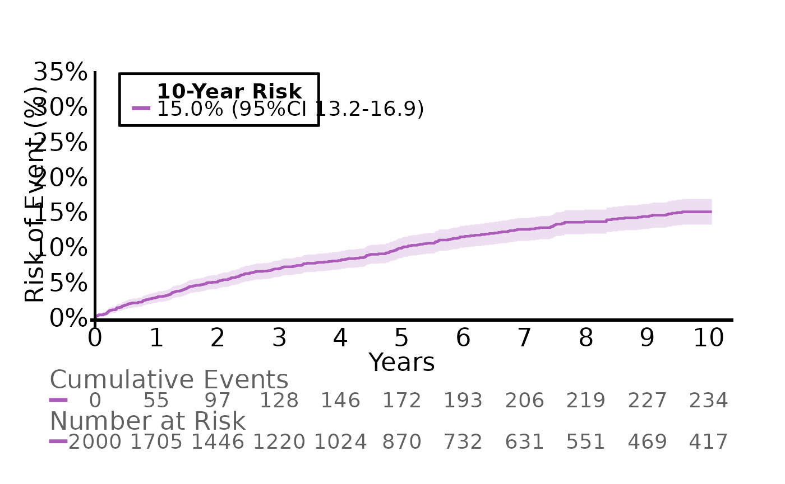
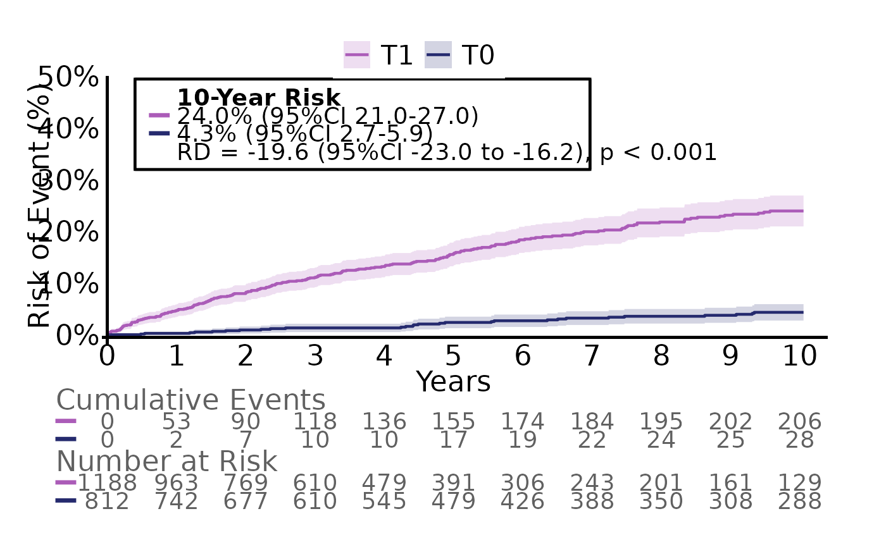
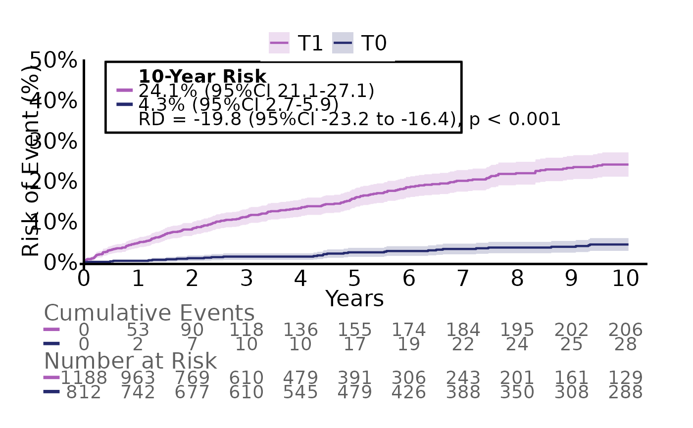
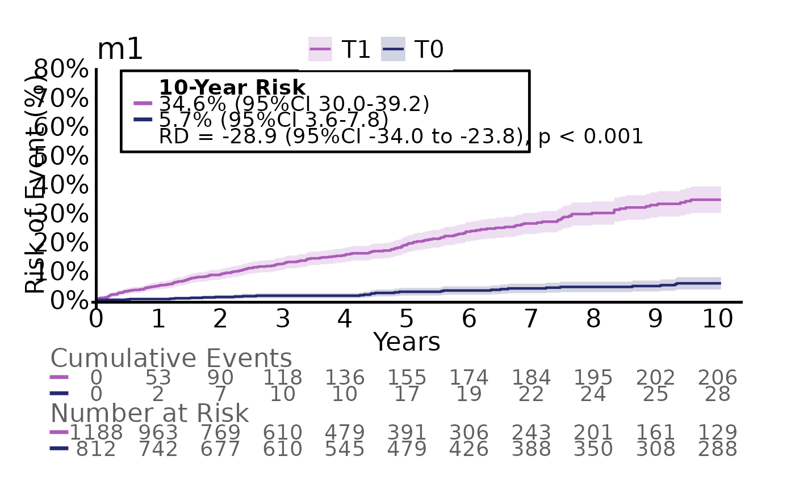
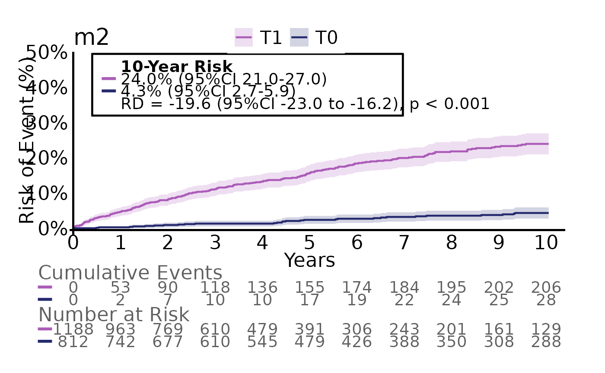
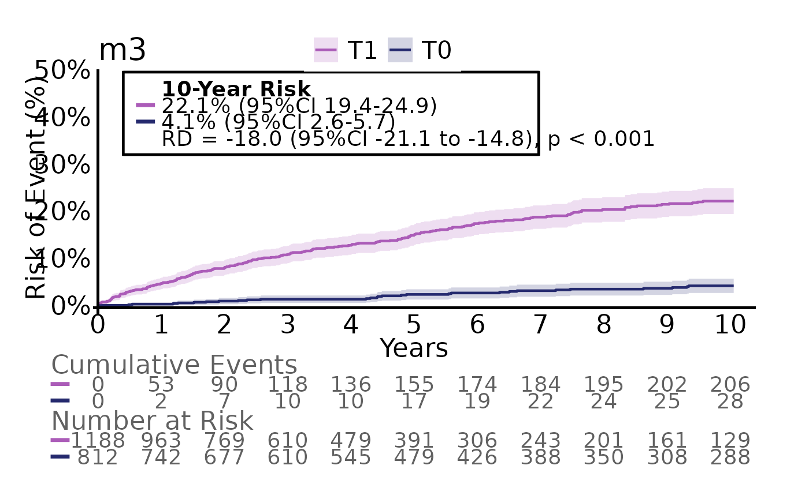

# Analysis of time-to-event data

The prerequisites for analysing time-to-event data are two columns: a
status indicator and a numeric time-to column for the current status.

    #>   status time
    #> 1      0    5
    #> 2      1    1
    #> 3      2    3

An alternative is to provide only dates for when the events occured
which is more simple (see `structR` below).

The status indicator indicates whether an event has occured and which
type of event.  
- 0 indicates that the patient was event free and the time column
indicates for how long the patient was followed (aka. censoring). This
can be at the end of the database or last clinical visit.  
- 1 indicates the main event of interest such has recurrence, metastasis
or death.  
- Values above 1 indicates competing events, which are events that
prevents the main event from occuring or events that makes the patient
irrelevant for further follow-up.  

In this example, the first patient was followed for 5 years with no
event occuring, the second patient had the event of interest after 1
year and the third patient had the competing event at 3 years.

### Conversion of dates to event/time columns

Often the events of interest are collected as dates as this
automatically includes both status (blank = 0, and present = 1) and the
time point. The `structR` function helps with converting dates to
status/time columns for multiple events. First, we simulate a dataframe
with 10 patients:

``` r

n=10
df <-
  data.frame(
    id = seq(1,n),
    opdate = c(rep("2000-01-01", n-1), "1990-01-01"),
           follow = rep("2025-01-01", n),
           recurrence_date = c(NA, "2005-01-01", NA, NA, NA, "2005-01-01", "2005-01-01", NA, "2005-01-01", "2005-01-01"),
           metastasis_date = c(NA, NA, "2007-01-01", NA, NA, "2006-01-01", "2005-01-01", NA, NA, NA),
           dsd_date = c(NA,NA, "2008-01-01", "2009-01-01", NA, NA, NA, NA, NA, NA),
           death_date = c(NA, NA, "2008-01-01", "2009-01-01", NA, "2010-01-01", "2010-01-01", "2024-01-01", "2019-01-01", "1999-01-01"),
           second_date = c(NA, NA, NA, NA, "2008-01-01", NA, "2001-01-01", NA, NA, NA)) %>%
  datR(c(opdate:second_date))
```

    #>    id     opdate     follow recurrence_date metastasis_date   dsd_date
    #> 1   1 2000-01-01 2025-01-01            <NA>            <NA>       <NA>
    #> 2   2 2000-01-01 2025-01-01      2005-01-01            <NA>       <NA>
    #> 3   3 2000-01-01 2025-01-01            <NA>      2007-01-01 2008-01-01
    #> 4   4 2000-01-01 2025-01-01            <NA>            <NA> 2009-01-01
    #> 5   5 2000-01-01 2025-01-01            <NA>            <NA>       <NA>
    #> 6   6 2000-01-01 2025-01-01      2005-01-01      2006-01-01       <NA>
    #> 7   7 2000-01-01 2025-01-01      2005-01-01      2005-01-01       <NA>
    #> 8   8 2000-01-01 2025-01-01            <NA>            <NA>       <NA>
    #> 9   9 2000-01-01 2025-01-01      2005-01-01            <NA>       <NA>
    #> 10 10 1990-01-01 2025-01-01      2005-01-01            <NA>       <NA>
    #>    death_date second_date
    #> 1        <NA>        <NA>
    #> 2        <NA>        <NA>
    #> 3  2008-01-01        <NA>
    #> 4  2009-01-01        <NA>
    #> 5        <NA>  2008-01-01
    #> 6  2010-01-01        <NA>
    #> 7  2010-01-01  2001-01-01
    #> 8  2024-01-01        <NA>
    #> 9  2019-01-01        <NA>
    #> 10 1999-01-01        <NA>

In the `structR` function we specify `index` as the time = 0 (date of
surgery, index date of disease etc.) and `fu` as the date where the
patient status was last known (last visit, end of database etc.).
`outcomes` specifies our events of interest and `competing` specifies
our competing events. If this includes death, a specific column for
death + time-to-death will also be generated for evaluation.

``` r

structR(df,
        index = opdate,
        fu = follow,
        outcomes=c(recurrence_date, metastasis_date, dsd_date),
        competing = c(death_date, second_date)) %>% head
#>   id     opdate     follow t_recurrence recurrence t_metastasis metastasis
#> 1  1 2000-01-01 2025-01-01       300.02          0       300.02          0
#> 2  2 2000-01-01 2025-01-01        60.02          1       300.02          0
#> 3  3 2000-01-01 2025-01-01        96.00          2        84.01          1
#> 4  4 2000-01-01 2025-01-01       108.02          2       108.02          2
#> 5  5 2000-01-01 2025-01-01        96.00          3        96.00          3
#> 6  6 2000-01-01 2025-01-01        60.02          1        72.02          1
#>    t_dsd dsd t_death death t_second second
#> 1 300.02   0  300.02     0   300.02      0
#> 2 300.02   0  300.02     0   300.02      0
#> 3  96.00   1   96.00     1   300.02      0
#> 4 108.02   1  108.02     1   300.02      0
#> 5  96.00   3  300.02     0    96.00      1
#> 6 120.02   2  120.02     1   300.02      0
```

Notice that for each specified outcome, we split the variable into two
columns: the variable prefix (status) and a t_variable (time). As we
specified two competing risks, the status for each event of interest can
have the values 2 and 3 for each competing risk.

If we want to specify a composite outcome, we use the argument
`composite` which is a named list of outcomes each specifying the events
of interest and the competing risks.

``` r

structR(df,
        index = opdate,
        fu = follow,
        outcomes=c(recurrence_date, metastasis_date),
        competing = c(death_date, second_date),
        composite = list("pfs" = list("outcomes" = c("recurrence_date", "metastasis_date", "death_date")),
                         "relapse" = list("outcomes" = c("recurrence_date", "metastasis_date", "dsd_date"),
                                          "competing" = c("death_date"))))
#>    id     opdate     follow pfs relapse t_recurrence recurrence t_metastasis
#> 1   1 2000-01-01 2025-01-01   0       0       300.02          0       300.02
#> 2   2 2000-01-01 2025-01-01   1       1        60.02          1       300.02
#> 3   3 2000-01-01 2025-01-01   1       1        96.00          2        84.01
#> 4   4 2000-01-01 2025-01-01   1       1       108.02          2       108.02
#> 5   5 2000-01-01 2025-01-01   0       0        96.00          3        96.00
#> 6   6 2000-01-01 2025-01-01   1       1        60.02          1        72.02
#> 7   7 2000-01-01 2025-01-01   1       1        12.02          3        12.02
#> 8   8 2000-01-01 2025-01-01   1       2       288.00          2       288.00
#> 9   9 2000-01-01 2025-01-01   1       1        60.02          1       228.01
#> 10 10 1990-01-01 2025-01-01   1       2       107.99          2       107.99
#>    metastasis t_death death t_second second  t_pfs t_relapse
#> 1           0  300.02     0   300.02      0 300.02    300.02
#> 2           0  300.02     0   300.02      0  60.02     60.02
#> 3           1   96.00     1   300.02      0  84.01     84.01
#> 4           2  108.02     1   300.02      0 108.02    108.02
#> 5           3  300.02     0    96.00      1 300.02    300.02
#> 6           1  120.02     1   300.02      0  60.02     60.02
#> 7           3  120.02     1    12.02      1  60.02     60.02
#> 8           2  288.00     1   300.02      0 288.00    288.00
#> 9           2  228.01     1   300.02      0  60.02     60.02
#> 10          2  107.99     1   420.01      0 107.99    107.99
```

## Time-to-event analysis

Time-to-event analysis is mainly performed with the `estimatR` function
which can handle different scenarios regarding number of groups and
adjustments. The following sections are:

- Analysis of one group
- Analysis of two groups
- Analysis of two groups with adjustment
- Analysis of two groups with multiple outcomes.

The `estimatR` function also comes with natural extension such as the
`extractR` function for extraction of results, `plotR` for visualizing
the survival/incidence curves, `savR` for saving the plots and `followR`
for estimating the median follow-up time

We use the built-in dataset `analysis_df` for all examples:

    #>   g2 g3 g4 event event2 event3 t_event        x6 x1 x2
    #> 1 T1 T2 T3     1      1      1  28.581  5.055129  0  c
    #> 2 T0 T0 T0     0      2      2  84.275  2.576219  0  d
    #> 3 T0 T0 T0     0      0      0  38.056 11.083184  1  d
    #> 4 T1 T1 T1     0      2      2  56.773  2.183576  0  a
    #> 5 T1 T2 T3     0      0      3   4.813 10.799597  1  a
    #> 6 T1 T1 T1     0      2      2   3.913 10.658211  0  b

`event2` is our event of interest and `t_event` is our time-to variable.
`g2` to `g4` are different groups with 2,3 and 4 levels resp. `x6` to
`x1` are covariates for later adjustment.

### Analysis of one group

For the analysis of a single group, we only need to specify the
arguments `data`, `timevar` and `event`:

``` r

g1_res <- estimatR(
  data = df,
  timevar = t_event,
  event = event2)
#> 
#> ── Initializing estimatR algorithm: 2026-10-06 09:51:26 ──
#> 
#> Preparing data:
#> ✔ Preparing data: Complete 2026-10-06 09:51:26, Runtime = 0 secs
#> Preparing data:Life-tables:
#> ✔ Life-tables: Complete 2026-10-06 09:51:26, Runtime = 0.02 secs
#> Life-tables:Modelling:
#> ✔ Modelling: Complete 2026-10-06 09:51:26, Runtime = 0 secs
#> Modelling:Plot data:
#> ✔ Plot data: Complete 2026-10-06 09:51:26, Runtime = 0.01 secs
#> Plot data:Time-to-event:
#> ✔ Time-to-event: Complete 2026-10-06 09:51:26, Runtime = 0.01 secs
#> Time-to-event:Event proportions:
#> ✔ Event proportions: Complete 2026-10-06 09:51:26, Runtime = 0.05 secs
#> Event proportions:Conditional risk:
#> ✔ Conditional risk: Complete 2026-10-06 09:51:26, Runtime = 0 secs
#> Conditional risk:
#> Conditional risk:── Estimation complete! 
#> Conditional risk:Total runtime:
#> Conditional risk:0.21 secs
#> Conditional risk:
#> Conditional risk:
```

We extract the main results with `extractR`

``` r

extractR(g1_res)
#>   grp     counts                risks
#> 1 grp 268 / 2000 15% (95%CI 13 to 17)
```

We can plot the corresponding cumulative incidence curve with `plotR`:

``` r

plotR(g1_res)
```



For customization of the plot write [`?plotR`](../reference/plotR.md) in
the console. The plot can be saved using `savR` such as
`savR(myplot, "plot_1", format = "pdf")`

The g1_res object also includes information regarding the median time to
event:

``` r

g1_res$time_to_event
#>            q median lower upper
#> 1 0.07519348  40.58 30.87 53.08
```

### Analysis of two groups

For the analysis of two groups we need to specify the `group` argument.
This will automatically detect the number of groups.

``` r

g2_res <- estimatR(
  df,
  timevar = t_event,
  event = event2,
  group = g2
)
#> 
#> ── Initializing estimatR algorithm: 2026-10-06 09:51:27 ──
#> 
#> Preparing data:
#> ✔ Preparing data: Complete 2026-10-06 09:51:27, Runtime = 0 secs
#> Preparing data:Life-tables:
#> ✔ Life-tables: Complete 2026-10-06 09:51:27, Runtime = 0.01 secs
#> Life-tables:Modelling:
#> ✔ Modelling: Complete 2026-10-06 09:51:29, Runtime = 1.98 secs
#> Modelling:Plot data:
#> ✔ Plot data: Complete 2026-10-06 09:51:30, Runtime = 1.09 secs
#> Plot data:Time-to-event:
#> ✔ Time-to-event: Complete 2026-10-06 09:51:30, Runtime = 0 secs
#> Time-to-event:Contrasts:
#> ✔ Contrasts: Complete 2026-10-06 09:51:30, Runtime = 0.01 secs
#> Contrasts:Event proportions:
#> ✔ Event proportions: Complete 2026-10-06 09:51:30, Runtime = 0.01 secs
#> Event proportions:Conditional risk:
#> ✔ Conditional risk: Complete 2026-10-06 09:51:30, Runtime = 0 secs
#> Conditional risk:
#> Conditional risk:── Estimation complete! 
#> Conditional risk:Total runtime:
#> Conditional risk:3.15 secs
#> Conditional risk:
#> Conditional risk:
```

Again, we extract the main results with `extractR`. Now we also see a
risk difference and a p-value as we can compare the two groups.

``` r

extractR(g2_res)
#>   g2     counts                   risks                          diff
#> 1 T1 221 / 1188    24% (95%CI 21 to 27)                     reference
#> 2 T0   47 / 812 4.3% (95%CI 2.7 to 5.9) -19.6% (95%CI -23.0 to -16.2)
#>   diff_p.value
#> 1    reference
#> 2    p < 0.001
```

And we can plot the curves.

``` r

plotR(g2_res)
```



### Analysis of two groups with adjustment

If we need to adjust for potential confounders we specify the `vars`
argument

``` r

g2_res <- estimatR(
  df,
  timevar = t_event,
  event = event2,
  group = g2,
  vars = c(x6,x1,x2)
)
#> 
#> ── Initializing estimatR algorithm: 2026-10-06 09:51:31 ──
#> 
#> Preparing data:
#> ✔ Preparing data: Complete 2026-10-06 09:51:31, Runtime = 0 secs
#> Preparing data:Life-tables:
#> ✔ Life-tables: Complete 2026-10-06 09:51:31, Runtime = 0.01 secs
#> Life-tables:Modelling:
#> ✔ Modelling: Complete 2026-10-06 09:51:32, Runtime = 1.38 secs
#> Modelling:Plot data:
#> ✔ Plot data: Complete 2026-10-06 09:51:34, Runtime = 1.55 secs
#> Plot data:Time-to-event:
#> ✔ Time-to-event: Complete 2026-10-06 09:51:34, Runtime = 0 secs
#> Time-to-event:Contrasts:
#> ✔ Contrasts: Complete 2026-10-06 09:51:34, Runtime = 0 secs
#> Contrasts:Event proportions:
#> ✔ Event proportions: Complete 2026-10-06 09:51:34, Runtime = 0.01 secs
#> Event proportions:Conditional risk:
#> ✔ Conditional risk: Complete 2026-10-06 09:51:34, Runtime = 0 secs
#> Conditional risk:
#> Conditional risk:── Estimation complete! 
#> Conditional risk:Total runtime:
#> Conditional risk:3.01 secs
#> Conditional risk:
#> Conditional risk:
```

We can see that all estimates are slightly different as these are now
standardized

``` r

plotR(g2_res)
```



### Analysis of two groups with multiple outcomes

When evaluating multiple outcomes, we want to avoid repeating the same
code for each outcome. `iteratR` makes this more easier. The arguments
are the same as in `estimatR`, although they need to be quoted.

Here we evalute the outcomes event, event2 and event3 with the same
group

``` r


g2_multires <- iteratR(
  data=df,
  timevar = "t_event",
  event = c("event", "event2", "event3"),
  group = "g2",
  cancR.method = "estimatR",
  labels = c("model1", "model2", "model3"))
#> 
#> ── Initializing iteratR algorithm:  ──
#> 
#> ── Iteration complete!
#> Total runtime:
#> 4.88 secs
```

`g2_multires` is now a named list containing three `estimatR` objects
(model 1 to 3) which can be called separately

``` r

g2_multires$model1$time_to_event
#>   g2   quantile median lower  upper
#> 1 T1 0.17308183  56.79 36.49  69.94
#> 2 T0 0.02852238  58.49 22.91 112.06
```

We can also use `iteratR` to apply `extractR` on all models to extract
the main estimates

``` r

iteratR(
  g2_multires,
  cancR.method = "extractR"
)
#> 
#> ── Initializing iteratR algorithm:  ──
#> 
#> ── Iteration complete!
#> Total runtime:
#> 0.06 secs
#>   g2     counts                   risks                          diff
#> 1 T1 221 / 1188    35% (95%CI 30 to 39)                     reference
#> 2 T0   47 / 812 5.7% (95%CI 3.6 to 7.8) -28.9% (95%CI -34.0 to -23.8)
#> 3 T1 221 / 1188    24% (95%CI 21 to 27)                     reference
#> 4 T0   47 / 812 4.3% (95%CI 2.7 to 5.9) -19.6% (95%CI -23.0 to -16.2)
#> 5 T1 221 / 1188    22% (95%CI 19 to 25)                     reference
#> 6 T0   47 / 812 4.1% (95%CI 2.6 to 5.7) -18.0% (95%CI -21.1 to -14.8)
#>   diff_p.value  model
#> 1    reference model1
#> 2    p < 0.001 model1
#> 3    reference model2
#> 4    p < 0.001 model2
#> 5    reference model3
#> 6    p < 0.001 model3
```

We can also plot all three models by changing method to `plotR`

``` r

iteratR(
  g2_multires,
  title = c("m1", "m2", "m3"),
  cancR.method = "plotR"
)
#> 
#> ── Initializing iteratR algorithm:  ──
#> 
#> ── Iteration complete!
#> Total runtime:
#> 0.25 secs
```


