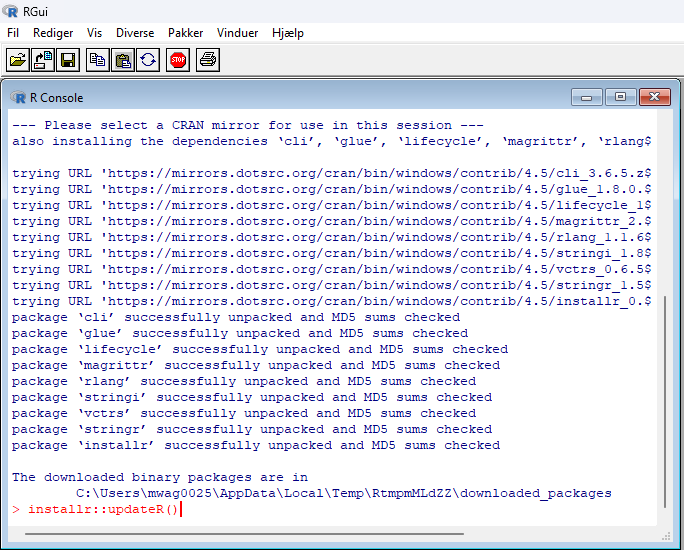

# Install and Update R

## Introduction

This article is for installing R if it has not been installed before and
for updating R if this is needed. If R is already installed, skip the
installation chapter.

## Installation of R

R is installed from softwareshoppen which is found at the desktop. Click
“installer” and “bestil” and wait for 10 to 15 minutes.

After the instillation of R, we also need to install R-studio and wait
again.

## Update R

R can be updated directly in R, as softwareshoppen is not always
up-to-date. This requires a specific package called “installr”. The
installation needs to be run directly from R and not R-studio.

### Step 1

Open R (not R studio)

### Step 2

Install the package “installr” by typing install.packages(“installr”) in
R.

### Step 3

Once the package has been installed, use the function “updateR()” by
typing installr::updateR()

### Step 4

Follow the installation process by clicking next and ok to all boxes.

When the installation is complete, close R and open Rstudio.

### Step 5

To confirm that R has correctly been updated, open R-studio and notice
the version in the upper right corner

You have now successfully updated R

### Step 6

If the latest version of R is not showing correctly in Rstudio, close
Rstudio. Now open Rstudio by holding down ctrl while clicking on the
Rstudio logo. Now you can choose the correct version of R.
