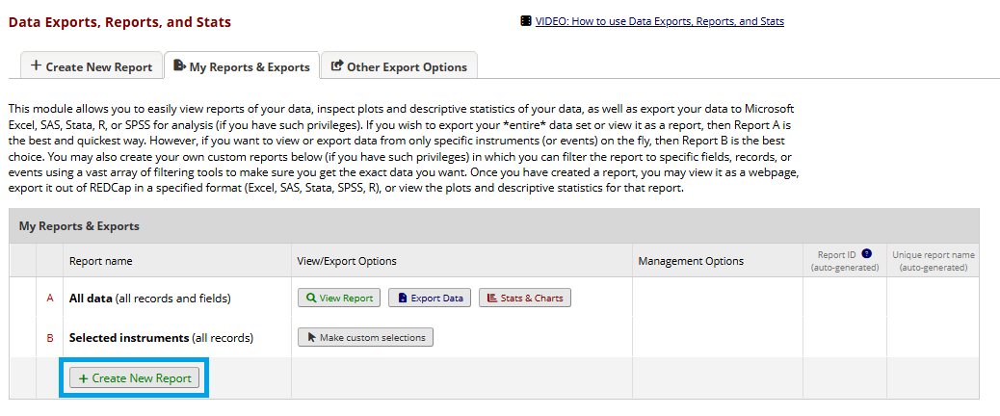
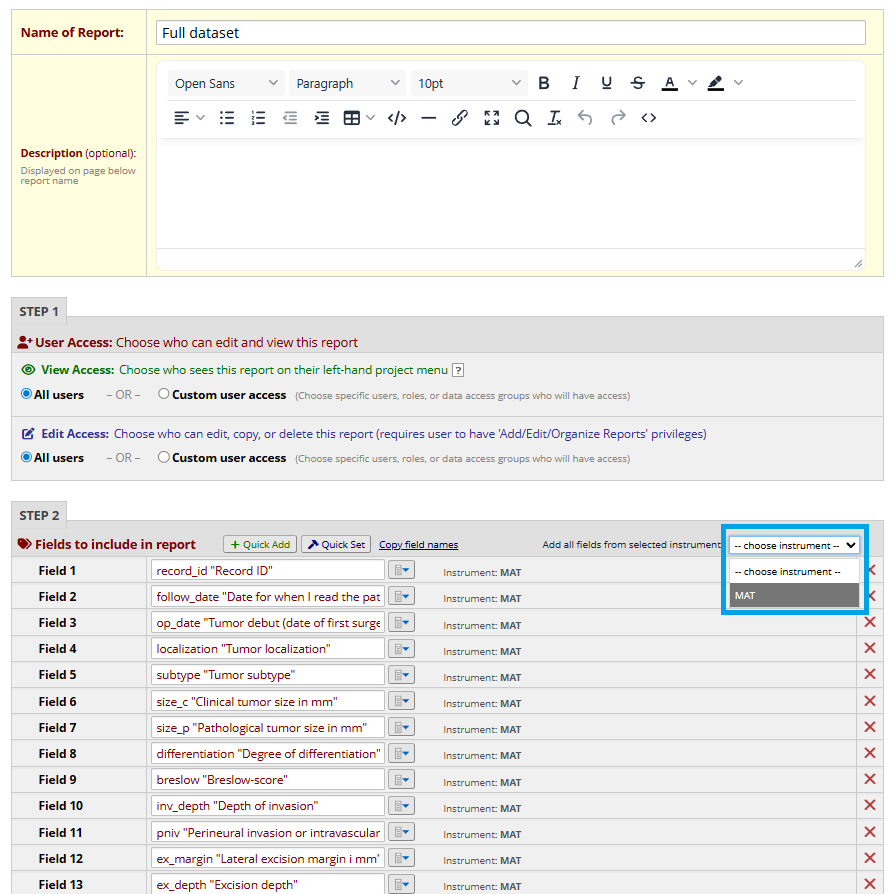
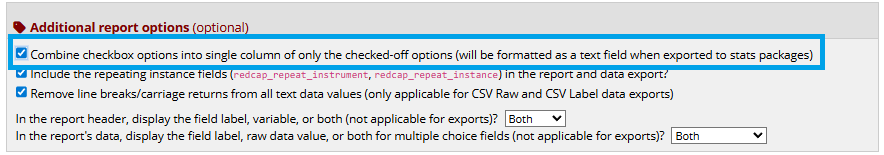
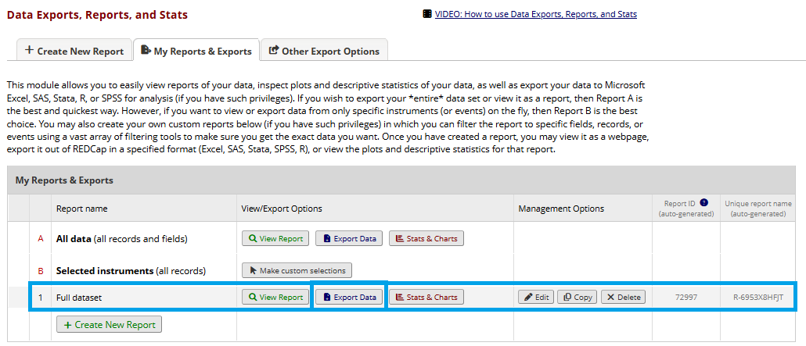
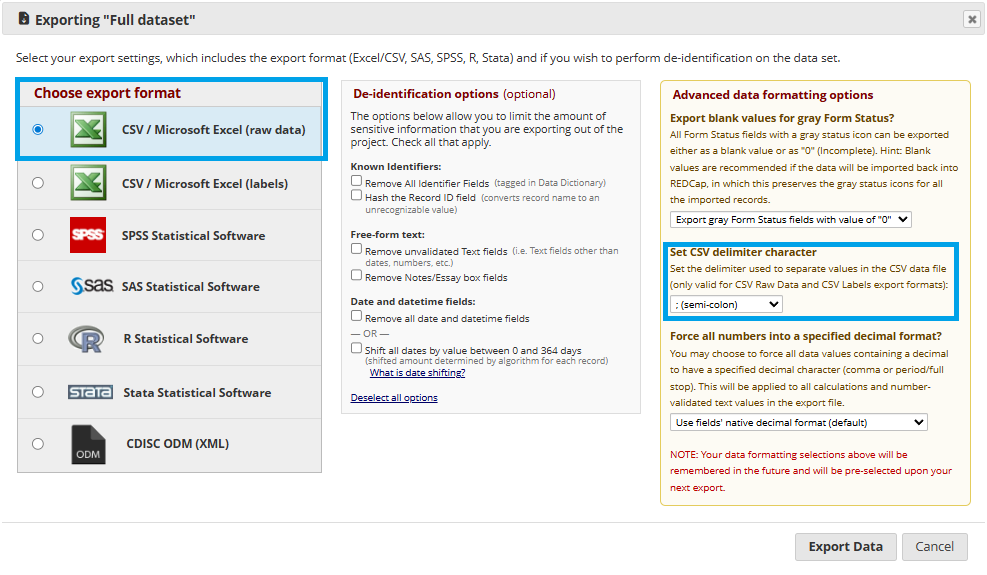
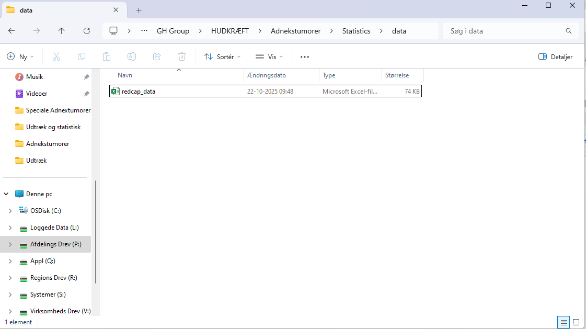

# Redcap and R

## Define the export

Open your project in Redcap and find the export tab on the left side


Now create a new report. Here you define which parts of the data in
redcap you wish to export.



Give the report a name and choose the name of the project under “Add
fields from instrument”. This adds all data from that specific
instrument. In this example the project (instrument) is named MAT.



An important field that needs to be checked is that multiple values
should be collapsed into one column



## Export Redcap data

When a report/export has been defined it will show in the data exports.
Select “export data” to export the specified data in that given export.



The format should be semi-colon separated csv.



Next, move the file to the data folder in your statistics folder for the
project


Rename the file for brevity, here we name it redcap_df. If multiple
datasets are placed here add a date.



Finally, load the data into R using the function
[`readR()`](../reference/readR.md). The path can be simplified to:
“data/redcap_data.csv” as the project file already knows the entire path
to the main folder (working directory). Here we assign the data to the
object “raw”.

``` r
mydata <- readR("data/redcap_data.csv")
```

## Import redcap with labels

Redcap sheets do not automatically come with all the customized labels
from the redcap modules. To import these, use the `redcapR` function.
The function needs a redcap dataset (in this case our redcap_data.csv)
and the data dictionary that contains all labels.

The data dictionary can be found in the `Dictionary panel`


When the redcap dataset and data dictionary have been saved in the
`data` folder, they can be used in the
[`redcapR()`](../reference/redcapR.md) function

``` r
redcap_data <- readR("data/redcap_data.csv")
dictionary <- readR("data/data_dictionary.csv")

mydata <- redcapR(redcap_data,
                  dictionary)
```
