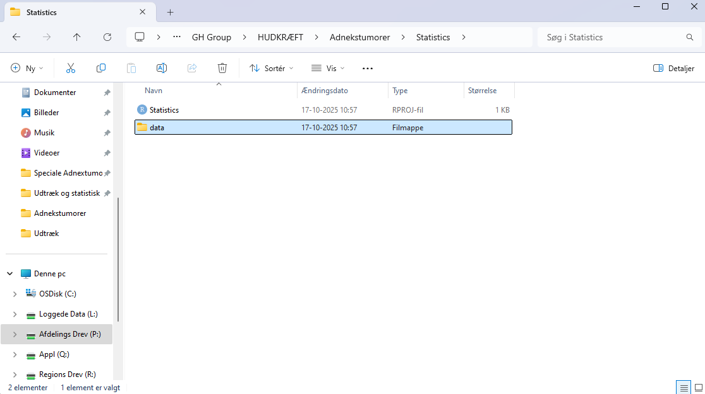
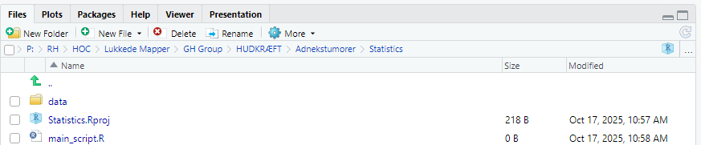
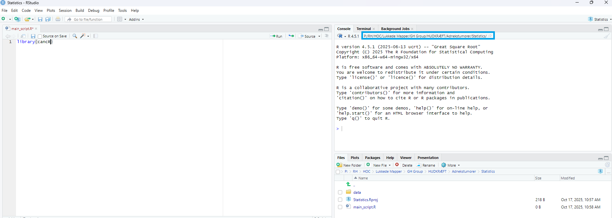

# Setup and New Projects

## Basic setup

The first time you use R, it should be properly set up for optimal use.
The main page looks like this:

In the tools pane, choose global settings and pane layout. Here we
switch the placment of the console and environment and save the choices.

Now R should look like this and is ready for use.

## Setup new projects

It is important that all projects are set up using the R project
structure. This ensures that R will always be able to identify the
correct project folder (working directory). It makes loading and saving
data more easy as R will automatically use the path to the main folder
and not place files in other folders. It also makes R robust to changes
in the path or folder structures, as the folder where the project file
is located will always be assigned as the working directory. When the
project file has been created, you should always open R via the project
file of the specific project to enable the features described above!

First, find the folder of your project and create a new statistics
folder

Next open R and create a new R project file in the upper left corner,
under file:

Choose existing directory and choose the statistics folder you just
created

Now, create a folder named data for datasheets in the statistics folder

Lastly, create a new R script in the upper left corner, under file and
save it at the blue disc in the left corner.

If everything is correctly set up, you should see an R script, an R
project file and a data folder in the lower right corner:

## Working with existing projects

When the project structure has been set up it is important to open R via
the project file (.RPROJ) everytime you work on the project. This
activates all the features described above. The project file does not do
anything else than opening the project correctly.

When R is open, you can open your script via R or directly from the
folder

If R is not opened via the project file, the working directory is not
set up correctly and loading and saving could be from another folder
such as the default R folder or the previous project that was open i R.

The current working directory is shown in the upper right corner

