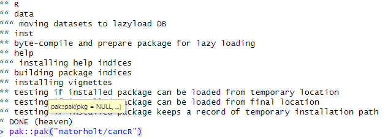

```{r, include = FALSE}
knitr::opts_chunk$set(
  collapse = TRUE,
  comment = "#>"
)
```

## Quick start

If the cancR package has previously been installed on the computer and needs to be updated, use the pak-package with the command pak::pak(matorholt/cancR)

```{r, echo=F, out.width="100%"}

```

## Install cancR

If the cancR package has not been installed before, there are four steps.

### Step 1

Install the packages "devtools" and "pak" using the command install.packages(c("devtools", "pak"))
```{r, echo=F, out.width="80%"}
knitr::include_graphics("c_2.png")
```

### Step 2

Install the latest version of Rtools from their website: 
https://cran.r-project.org/bin/windows/Rtools/rtools45/files/rtools45-6608-6492.exe and follow the instructions

### Step 3

Install the heaven package using devtools by writing the command devtools::install_github("tagteam/heaven")

```{r, echo=F, out.width="50%"}

```


### Step 4

Now install the cancR package with the pak command (same as the "quick start")

```{r, echo=F, out.width="100%"}

```


If everything is correct it should look like the following

```{r, echo=F, out.width="100%"}
knitr::include_graphics("c_5.png")
```

