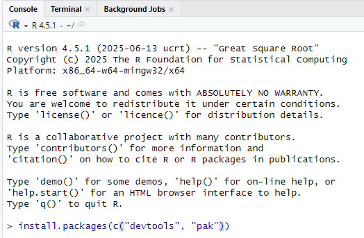
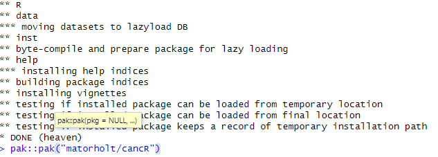
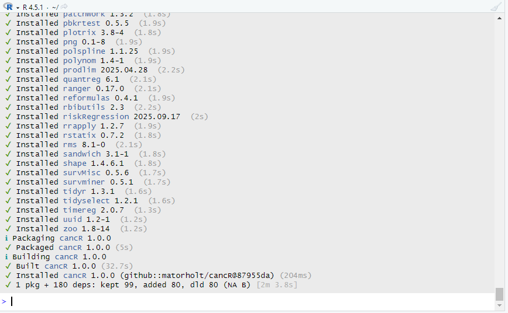

```{r, include = FALSE}
knitr::opts_chunk$set(
  collapse = TRUE,
  comment = "#>"
)
```

## Update cancR

If the cancR package has previously been installed on the computer and needs to be updated, use the pak-package with the command `pak::pak("matorholt/cancR")`. R needs to be restarted after installing/updating cancR.

The cancR package is still under development, so regular updates are recommended.

## Install cancR

If the cancR package has not been installed before, there are four steps.

### Step 1

Install the packages "devtools" and "pak" using the command `install.packages(c("devtools", "pak"))`

```{r, echo=F, out.width="80%"}

```

### Step 2

Install the latest version of Rtools from their website: 
https://cran.r-project.org/bin/windows/Rtools/rtools45/rtools.html (click on the link "Rtools45 installer") and follow the instructions

### Step 3

Install the heaven package using devtools by writing the command `devtools::install_github("tagteam/heaven")`.

NB: Currently, a bug in the heaven repo throws an error. Install a previous version instead: `devtools::install_github("tagteam/heaven@eb4a937")`

### Step 4

Now install the cancR package with the pak command `pak::pak("matorholt/cancR")` (same as the "quick start")

```{r, echo=F, out.width="100%"}

```


If everything is correct it should look like the following

```{r, echo=F, out.width="100%"}

```

