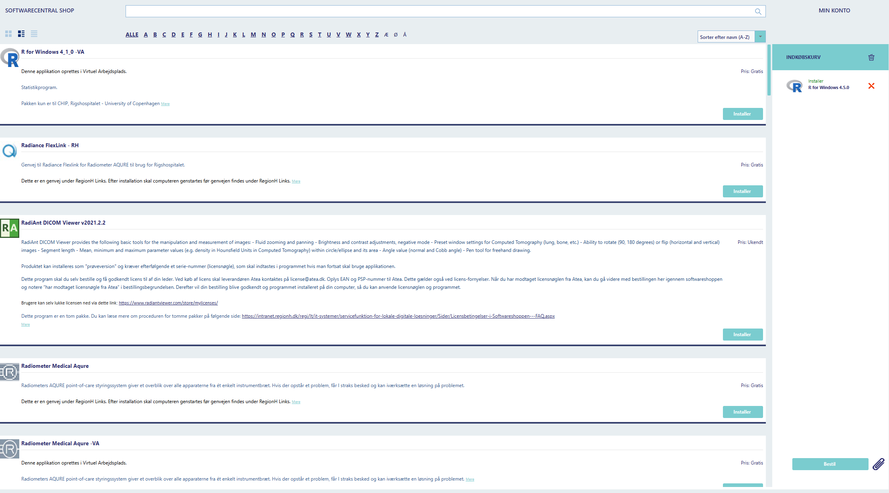

```{r, include = FALSE}
knitr::opts_chunk$set(
  collapse = TRUE,
  comment = "#>"
)
```

This is an introduction to the cancR package.The article describes the workflow and main functions in the cancR package with in-depth examples. 

# Preparation

The cancR package is installed through github, see separate article.

```{r message = FALSE, warning = FALSE}
library(cancR)
```

To demonstrate the functions useful in data management, we load the simulated redcap dataframe

```{r, echo=F, out.width="100%"}

```

#test two
```{r}
2+2
```

