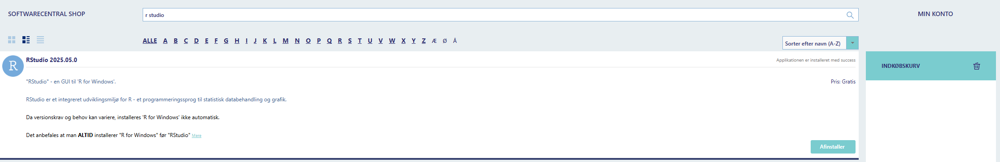
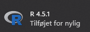
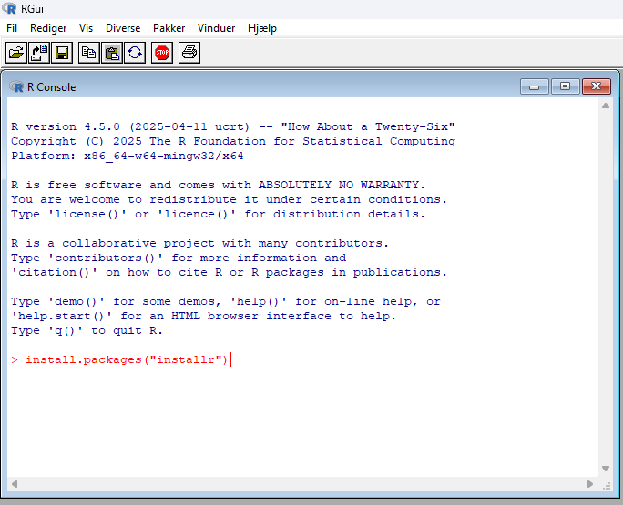
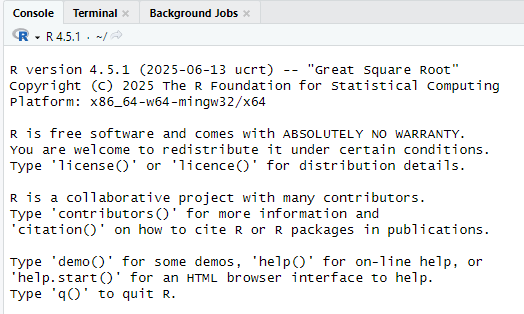

```{r, include = FALSE}
knitr::opts_chunk$set(
  collapse = TRUE,
  comment = "#>"
)
```

## Introduction

This article is for installing R if it has not been installed before and for updating R if this is needed. If R is already installed, skip the installation chapter.

## Installation of R

R is installed from softwareshoppen which is found at the desktop. Click "installer" and "bestil" and wait for 10 to 15 minutes.

```{r, echo=F, out.width="100%"}
knitr::include_graphics("ss_1.png")
```


After the instillation of R, we also need to install R-studio and wait again.

```{r, echo=F, out.width="100%"}

```

## Update R

R can be updated directly in R, as softwareshoppen is not always up-to-date. This requires a specific package called "installr". The installation needs to be run directly from R and not R-studio.

### Step 1

Open R (not R studio)

```{r, echo=F, out.width="30%"}

```

### Step 2

Install the package "installr" by typing install.packages("installr") in R.

```{r, echo=F, out.width="100%"}

```

### Step 3

Once the package has been installed, use the function "updateR()" by typing installr::updateR()

```{r, echo=F, out.width="100%"}
knitr::include_graphics("u_3.png")
```

### Step 4

Follow the installation process

```{r, echo=F, out.width="50%", fig.align = "center"}
knitr::include_graphics(paste0("u_", seq(4,9), ".png"))
```

### Step 5

To confirm that R has correctly been updated, open R-studio and notice the version in the upper right corner

```{r, echo=F, out.width="80%"}

```

You have now successfully updated R

