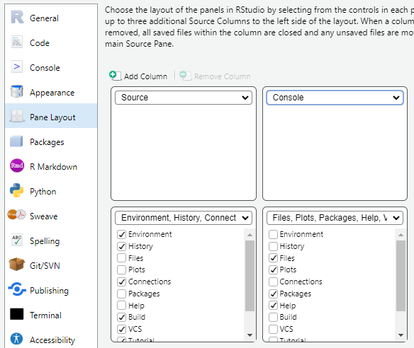

```{r, include = FALSE}
knitr::opts_chunk$set(
  collapse = TRUE,
  comment = "#>"
)
```

## Basic setup

The first time you use R, it should be properly set up for optimal use. The main page looks like this:

```{r, echo=F, out.width="100%"}

```

In the tools pane, choose global settings and pane layout. Here we switch the placment of the console and environment and save the choices.

```{r, echo=F, out.width="50%", fig.align = "center"}

```

```{r, echo=F, out.width="80%", fig.align = "center"}

```

Now R should look like this and is ready for use.

```{r, echo=F, out.width="100%"}
knitr::include_graphics("figures/p_4.png")
```

## Setup new projects

It is important that all projects are set up using the R project structure. This ensures that R will always be able to identify the correct project folder (working directory). It makes loading and saving data more easy as R will automatically use the path to the main folder and not place files in other folders. It also makes R robust to changes in the path or folder structures, as the folder where the project file is located will always be assigned as the working directory. When the project file has been created, you should always open R via the project file of the specific project to enable the features described above!

First, find the folder of your project and create a new statistics folder

```{r, echo=F, out.width="100%"}
knitr::include_graphics("figures/p_5.png")
```


Next open R and create a new R project file in the upper left corner, under file:

```{r, echo=F, out.width="50%", fig.align = "center"}

```

Choose existing directory and choose the statistics folder you just created

```{r, echo=F, out.width="80%", fig.align = "center"}
knitr::include_graphics(c("figures/p_7.png", "figures/p_8.png"))
```

Now, create a folder named data for datasheets in the statistics folder

```{r, echo=F, out.width="100%"}
knitr::include_graphics("figures/p_9.png")
```

Lastly, create a new R script in the upper left corner, under file and save it at the blue disc in the left corner.

```{r, echo=F, out.width="50%", fig.align = "center"}
knitr::include_graphics("figures/p_10.png")
```

If everything is correctly set up, you should see an R script, an R project file and a data folder in the lower right corner:

```{r, echo=F, out.width="100%"}
knitr::include_graphics("figures/p_11.png")
```


